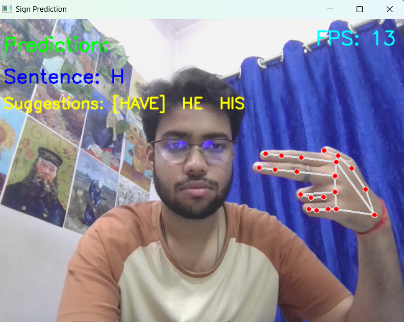

# Sign Language Translator

A real-time sign language recognition system using MediaPipe and Machine Learning that converts hand gestures into text and speech.

## Features
- Real-time hand gesture recognition
- Text generation from sign language
- Word suggestion system
- Text-to-speech output
- Two-hand gesture commands (space, clear, delete, speak)

## Tech Stack
Python  
OpenCV  
MediaPipe  
Scikit-learn  
NumPy  
pyttsx3

## Project Structure

```
dataset/       → Gesture datasets  
src/           → Source code  
model/         → Trained ML model  
predict_sign.py → Main application  
```

## How It Works

1. MediaPipe detects hand landmarks.
2. Landmarks are fed into a trained ML model.
3. The model predicts the corresponding letter.
4. Letters form words and sentences.
5. NLP suggests possible word completions.
6. The system can speak the sentence aloud.

## How to Run

Install dependencies:

```
pip install -r requirements.txt
```

Run the program:

```
python src/predict_sign.py
```

## Example Commands

SPACE → Separate words  
CLEAR → Clear sentence  
DELETE → Remove last letter  
SPEAK → Convert sentence to speech  

## Future Improvements

• Full A–Z gesture support  
• Deep learning based model  
• GUI interface  
• Higher prediction accuracy

## Demo


