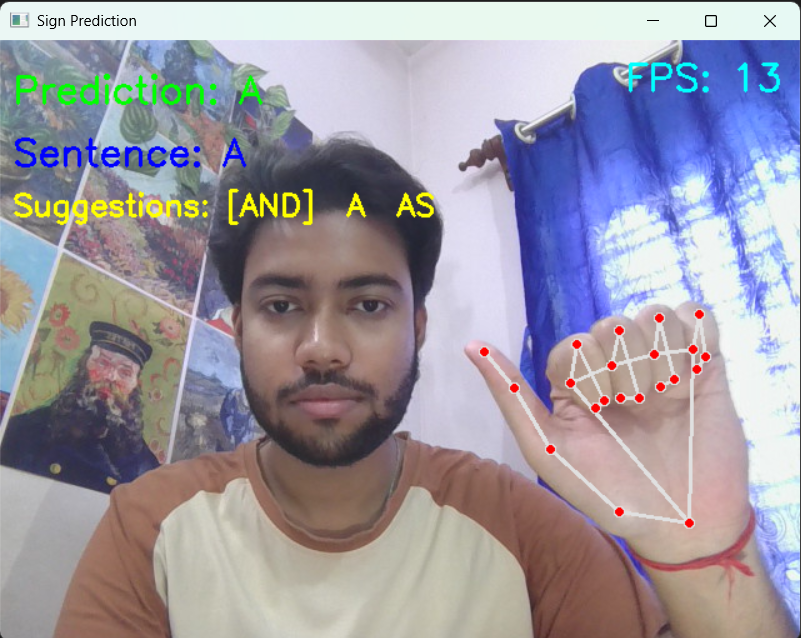

# Sign Language Translator

A real-time sign language recognition system that converts hand gestures into text and speech using computer vision and machine learning.

# Overview

This project focuses on improving accessibility by enabling basic communication through sign language recognition. It captures hand gestures using a webcam, processes them using MediaPipe, and predicts corresponding characters using a trained machine learning model.

The system is designed to work in real time and supports continuous sentence formation along with speech output.

## Features
- Real-time hand gesture recognition
- Text generation from sign language
- Word suggestion system
- Text-to-speech output
- Two-hand gesture commands (space, clear, delete, speak)

## Tech Stack
Python  
OpenCV  
MediaPipe  
Scikit-learn  
NumPy  
pyttsx3

## Project Structure

```
dataset/       → Gesture datasets  
src/           → Source code  
model/         → Trained ML model  
predict_sign.py → Main application  
```

## System Workflow

1. MediaPipe extracts hand landmarks from webcam input.
2. Landmarks are fed into a trained ML model.
3. The model predicts the corresponding letter.
4. Characters are combined to form words and sentences
5. A simple suggestion system assists in completing words
6. The system can speak the sentence aloud.

## How to Run

Install dependencies:

```
pip install -r requirements.txt
```

Run the program:

```
python src/predict_sign.py
```

## Example Commands

SPACE → Separate words  
CLEAR → Clear sentence  
DELETE → Remove last letter  
SPEAK → Convert sentence to speech  

## Future Improvements

* Limited gesture vocabulary (not full A–Z)
* Performance depends on lighting and hand visibility
* Future improvements:

  * Expand gesture dataset
  * Improve model accuracy
  * Integrate deep learning models
  * Build a GUI for better usability

## Demo


